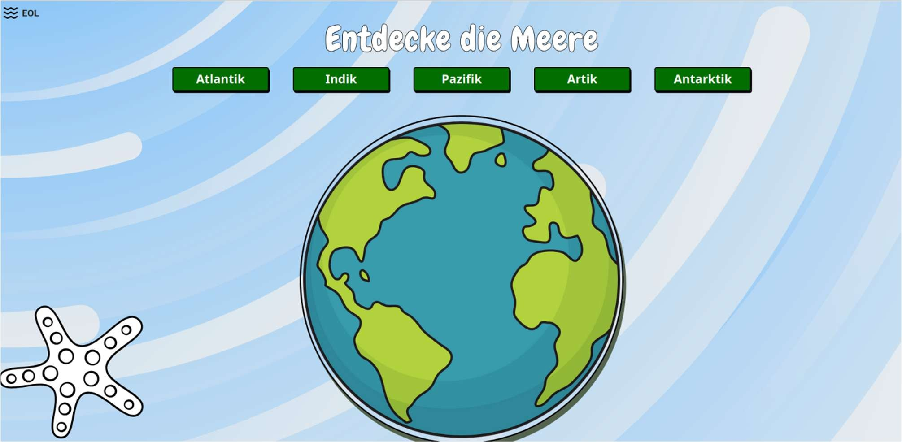
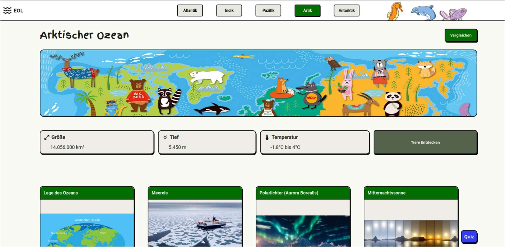
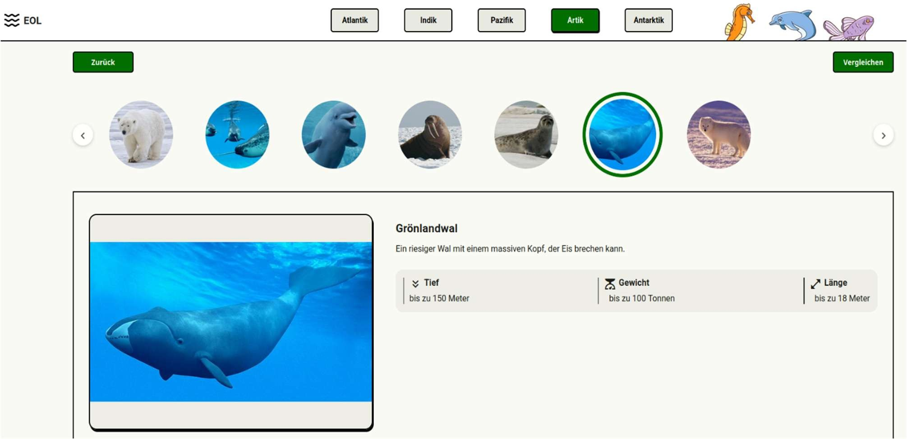
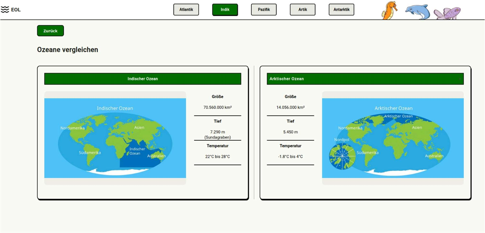
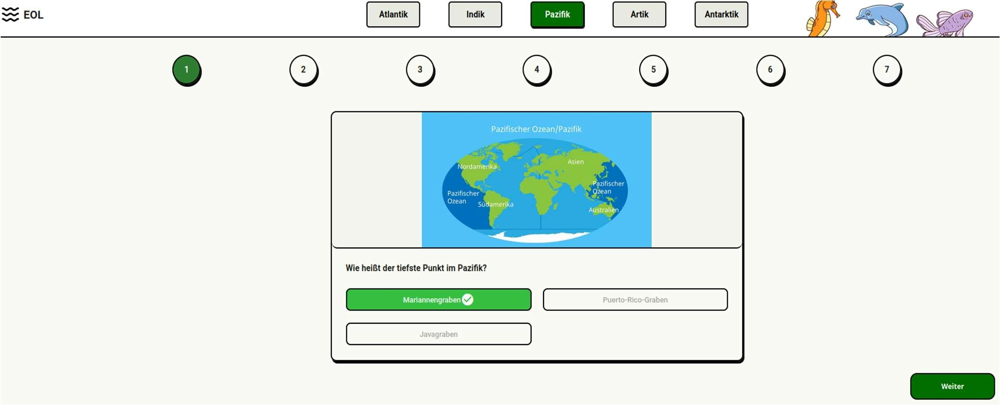

# Earth Oceans Learning App


Eine lehrreiche und interaktive Webanwendung, die mit **Angular** entwickelt wurde. Ihr Ziel ist es, Wissen über die Ozeane unserer Erde und deren Meereslebewesen zu vermitteln und zum Entdecken einzuladen. Die App umfasst verschiedene Themenbereiche sowie ein interaktives Quiz, um das Gelernte zu testen.


### App Screenshots

<table align="center">
  <tr>
    <td><br><sub>Startseite</sub></td>
    <td><br><sub>Meerseite</sub></td>
    <td><br><sub>Tiereseite</sub></td>
  </tr>
  <tr>
    <td><br><sub>Vergleichseite</sub></td>
    <td><br><sub>Quizseite</sub></td>
    <td></td>
  </tr>
</table>


### Verwendete Technologien
* **Framework:** [Angular](https://github.com/angular/angular-cli) (Version 20.3.7)
* **Basissprachen:** HTML, TypeScript, CSS und SCSS

### Struktur und Funktionen
Die Anwendung ist in folgende Hauptbereiche unterteilt:
- **Startseite:** Einführung in die Anwendung und Übersicht.
- **Meerseite:** Detaillierte Informationen über die Ozeane unseres Planeten.
- **Tiereseite:** Katalog und spannende Fakten über verschiedene Meeresbewohner.
- **Vergleichseite:** Funktion zum visuellen und analytischen Vergleichen verschiedener mariner Elemente.
- **Quizseite:** Ein interaktives Spiel, um das in den anderen Bereichen erworbene Wissen auf die Probe zu stellen.

---
## Schritt-für-Schritt-Anleitung

### Voraussetzungen
Stelle sicher, dass [Node.js](https://nodejs.org/) sowie die Angular CLI installiert sind. Falls die Angular CLI noch nicht installiert ist, kannst du sie mit folgendem Befehl global hinzufügen:
```bash
npm install -g @angular/cli
```

### Repository klonen:
```bash
git clone https://github.com/osfurtado/earth-oceans-learning-angular-app.git
cd earth-oceans-learning-angular-app
```

### Projektabhängigkeiten installieren:
```bash
npm install
```

### Entwicklungsserver starten:
```bash
ng serve
```

### App aufrufen:
Öffne deinen Webbrowser und rufe http://localhost:4200/ auf. Die Anwendung wird automatisch neu geladen, sobald du Änderungen an den Quelldateien vornimmst.


## Author
Entwickelt von [Osvaldo Furtado](https://github.com/osfurtado).
